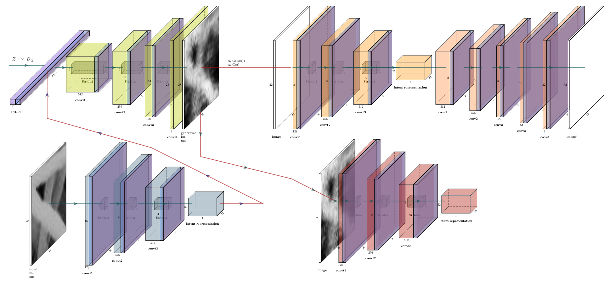
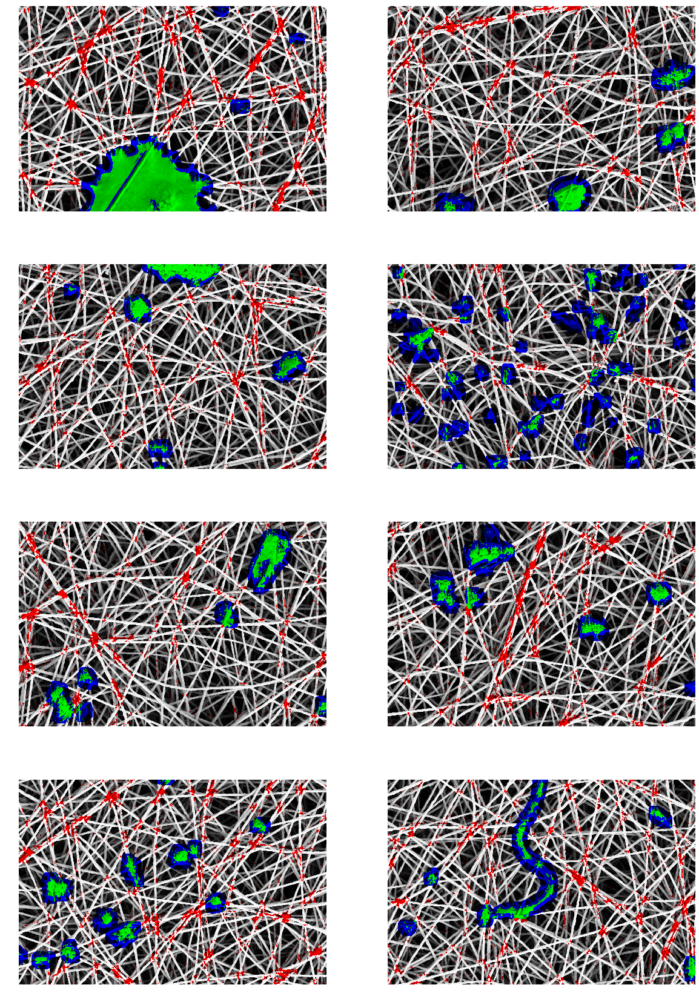

# Polimi Thesis
This is the repository for the Master's thesis titled "Anomaly Detection using Generative Adversarial Networks"

## Project Structure

The project and the hierarchy of the files are structured using [this](https://github.com/MrGemy95/Tensorflow-Project-Template) Github Project.

## Instructions

- If you don't have the data folder, in the first run model will download and create the dataset.
- All the experiment configurations and model parameters can be changed from the related config files.
* To create the same environment used in the project: 

```bash
conda create --name myenv -f environment.yml
```

* To run the model:

```bash
python3 run.py -c ./configs/\<CONFIGFILE\> -e \<EXPERIMENTNAME\>
```

* To perform tests with the model from a specific experiment
```bash
python3 run.py -c ./configs/\<CONFIG_FILE\> -e \<EXPERIMENT_NAME\> --test
```

## Model Overview



## Example from the dataset 


